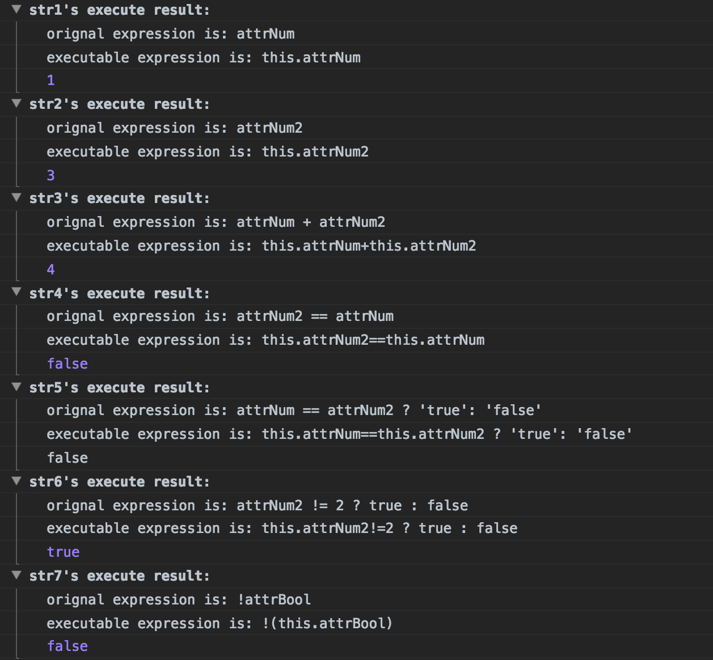
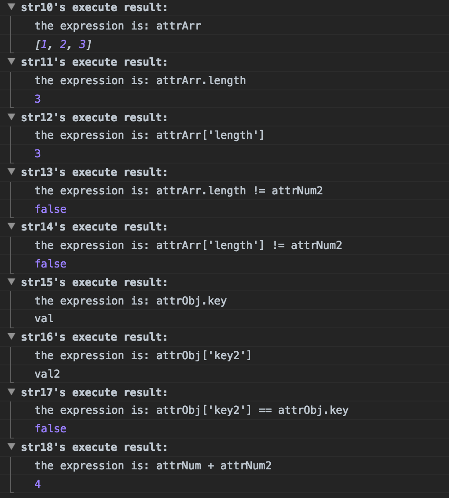

# parseObjectByString

根据相关字符串取得javascript对象中的属性并且计算出结果

举个🌰：

    //  定义一个对象,下面有这么些属性和值

        var obj = {
        "attrNum": 1,
        "attrNum2": 3,
        "attrBool": true,
        "attrStr": "str",
        "attrArr": [1, 2, 3],
        "attrObj": {
            "key": "val",
            "key2": "val2"
        }
    };
    
    //  然后定义一些如下的字符串
    
    var str1 = "attrNum";
    var str2 = "attrNum2";
    var str3 = "attrNum + attrNum2";
    var str4 = "attrNum2 == attrNum";
    var str5 = "attrNum == attrNum2 ? 'true': 'false'";
    var str6 = "attrNum2 != 2 ? true : false";

    var str7 = "!attrBool";

    var str8 = "attrStr != 'str'";
    var str9 = "attrStr.length";

    var str10 = "attrArr";
    var str11 = "attrArr.length";
    var str12 = "attrArr['length']";
    var str13 = "attrArr.length != attrNum2";
    var str14 = "attrArr['length'] != attrNum2";

    var str15 = "attrObj.key";
    var str16 = "attrObj['key2']";
    var str17 = "attrObj['key2'] == attrObj.key";

    var str18 = "attrNum + attrNum2";
    
    for (var i = 1; i <= 16; i++) {
        console.group("str" + i + "'s execute result:");
        console.log("the expression is: " + window["str" + i]);
        console.log(exec(window["str" + i], obj));
        console.groupEnd();
    }
    
进入浏览器控制台,将会看到下面的运行结果
    

------

##### TODO

暂时不支持带指定优先级(指定了"()")的计算,需要在复杂表达式上做处理

